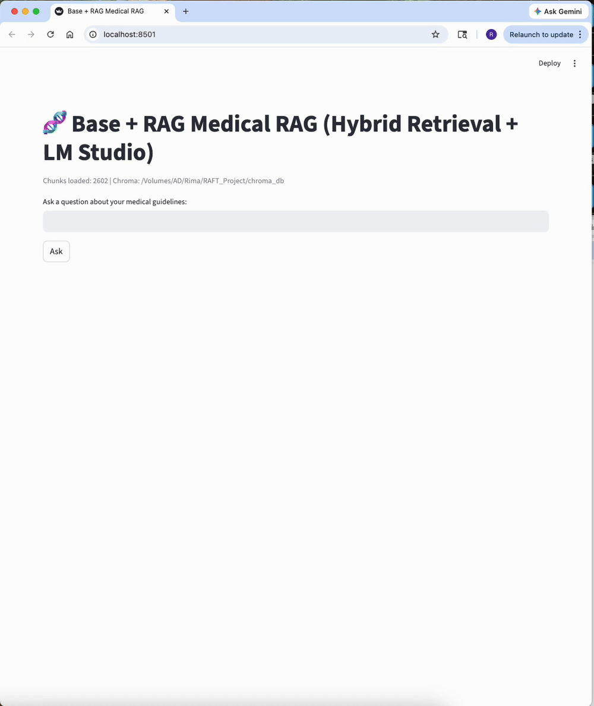

# RAFT + RAG on Medical Guidelines (Local, macOS)

Local document RAG over medical guideline PDFs using **OCR → Markdown → chunks → hybrid retrieval → grounded answers with citations**.

This project also includes a **RAFT-style fine-tuning experiment** for a small local model. After rebuilding the RAFT dataset, retraining the model, and rerunning evaluation, the fine-tuned local model improved over the base local model in both **frozen-context** and **end-to-end RAG** evaluation.

## Demo (Streamlit)



Run:

```bash
uv run streamlit run app.py
````

What the demo shows:

* Ask a question about the indexed guideline PDFs
* Retrieve evidence with hybrid search
* Generate an answer from the retrieved chunks
* Inspect source evidence with `pdf_name` and `chunk_id`

---

## Results

> These results come from a **small 10-question internal evaluation** under this project’s local setup.
> They are useful for comparing project variants, but they are **not a benchmark claim**.

### Frozen-context evaluation

Same evidence is provided to each model. This isolates **generation quality / faithfulness** more than retrieval quality.

| System           | Score | Notes                                                 |
| ---------------- | ----: | ----------------------------------------------------- |
| Base local model |  2/10 | Weak evidence-following on frozen contexts            |
| RAFT local model |  5/10 | Improved over base after dataset rebuild + retraining |
| GPT-4o-mini      |  9/10 | Strongest generation on the same evidence             |

### End-to-end RAG evaluation

Same project retriever, same 10-question set, but now the system must both **retrieve** and **generate**.

| System                     | Score | Notes                                                                            |
| -------------------------- | ----: | -------------------------------------------------------------------------------- |
| Base + RAG                 |  5/10 | Stronger than frozen-context base score, but still limited                       |
| RAFT + RAG                 |  6/10 | Improved over Base + RAG                                                         |
| GPT + same retriever + RAG | 10/10 | Suggests the retriever is capable and the local generator is the main bottleneck |

### Main takeaway

* **RAFT improved over the base local model**
* The improvement is **clearer in frozen-context evaluation**
* The improvement is **smaller but still present in end-to-end RAG**
* **GPT + the same retriever reached 10/10**, which suggests retrieval is reasonably strong and local generation quality is the main remaining bottleneck

### Scoring rubric

* **Correct (0/1):** the answer is factually correct for the question
* **Grounded (0/1):** the answer is supported by the provided evidence and the cited sources match the claim

---

## Project components

### Core pipeline

* PDF ingestion with OCR when needed (`docling[ocr]`)
* Markdown conversion
* Chunk dataset generation (`data/chunks/chunks.jsonl`)
* Hybrid retrieval:

  * ChromaDB semantic search
  * BM25 keyword search
  * RRF fusion
* Local inference through **LM Studio** (OpenAI-compatible server)
* Streamlit demo app and CLI app
* Controlled evaluation harness for frozen-context and end-to-end RAG comparison

### RAFT experiment

* RAFT-style training data built from oracle chunks + distractors
* Dataset generation improved with:

  * fenced JSON cleanup
  * oracle chunk filtering
  * generated QA filtering
* Final cleaned RAFT dataset size: **135 rows**
* Fine-tuned local model exported as GGUF and loaded in LM Studio

---

## Repository docs

* Main project docs: `README.md`
* Dataset notes: `data/README.md`
* RAFT fine-tuning notes: `notebooks/README.md`

---

## Quickstart

<details>
<summary><b>1) Clone the repo</b></summary>

```bash
git clone https://github.com/sahandi/raft-rag-medical-guidelines.git
cd raft-rag-medical-guidelines
```

</details>

<details>
<summary><b>2) Set up the environment</b></summary>

```bash
./scripts/initproject.sh
```

</details>

<details>
<summary><b>3) Add PDFs</b></summary>

Put your medical guideline PDFs into:

```text
data/raw/
```

See:

* `data/README.md`
* `data/raw/manifest.csv`

</details>

<details>
<summary><b>4) Build the document pipeline</b></summary>

```bash
uv run python scripts/ingest_pdfs.py
uv run python scripts/make_chunks.py
uv run python scripts/build_index.py
```

</details>

<details>
<summary><b>5) Run the Streamlit demo</b></summary>

```bash
uv run streamlit run app.py
```

</details>

---

## Pipeline scripts

> If you kept your local rename commit, replace these filenames with the renamed versions in your branch.

* `scripts/ingest_pdfs.py` — PDF → Markdown
* `scripts/make_chunks.py` — Markdown → `data/chunks/chunks.jsonl`
* `scripts/build_raft_dataset.py` — generate RAFT-style training data
* `scripts/build_index.py` — build ChromaDB index
* `scripts/rag_cli.py` — local CLI RAG demo
* `scripts/build_frozen_contexts.py` — build frozen-context evaluation inputs
* `scripts/run_openai_frozen_eval.py` — run OpenAI on frozen contexts
* `scripts/run_lmstudio_frozen_eval.py` — run local LM Studio frozen-context evaluation
* `scripts/run_openai_rag_e2e.py` — run end-to-end GPT RAG evaluation
* `scripts/parse_rag_txt_to_jsonl.py` — standardize raw evaluation outputs into JSONL

---

## Run with LM Studio (local models)

<details>
<summary><b>1) Start LM Studio server</b></summary>

In LM Studio:

1. Load your local model
2. Enable the **OpenAI-compatible server**
3. Confirm the base URL is available, typically:

```text
http://127.0.0.1:1234/v1
```

</details>

<details>
<summary><b>2) Run the CLI demo</b></summary>

```bash
export LMSTUDIO_MODEL="qwen2.5-0.5b-raft.gguf"
uv run python scripts/rag_cli.py
```

You can also switch back to your base local model by changing `LMSTUDIO_MODEL`.

</details>

<details>
<summary><b>3) Run the Streamlit UI</b></summary>

```bash
uv run streamlit run app.py
```

</details>

---

## Evaluation

### Frozen-context evaluation

This controlled evaluation is designed to be more defensible:

* Freeze which chunks are used per question
* Provide the exact same evidence to multiple models
* Compare answer quality on the same sources

Inputs:

* `data/eval/raw/questions.txt`
* `data/eval/frozen_sources.jsonl`

Build frozen contexts:

```bash
uv run python scripts/build_frozen_contexts.py
```

Run OpenAI on frozen contexts:

```bash
export OPENAI_API_KEY="YOUR_KEY"
export OPENAI_MODEL="gpt-4o-mini"
uv run python scripts/run_openai_frozen_eval.py
```

Run local LM Studio frozen evaluation:

```bash
export LMSTUDIO_MODEL="qwen2.5-0.5b-raft.gguf"
uv run python scripts/run_lmstudio_frozen_eval.py
```

### End-to-end RAG evaluation

This evaluation uses the full project pipeline:

* question
* retrieval
* grounded generation
* scored output

Run OpenAI end-to-end RAG evaluation:

```bash
export OPENAI_API_KEY="YOUR_KEY"
export OPENAI_MODEL="gpt-4o-mini"
uv run python scripts/run_openai_rag_e2e.py
```

Standardized outputs are stored under:

```text
data/eval/out/
```

Current structure includes:

* `frozen_context/base`
* `frozen_context/raft`
* `frozen_context/gpt`
* `frozen_context/shared`
* `end_to_end_rag/base_rag`
* `end_to_end_rag/raft_rag`
* `end_to_end_rag/gpt_rag`
* `eval_summary.csv`

---

## Project structure

```text
app.py
data/
  raw/
  markdown/
  chunks/
  raft/
  eval/
docs/
notebooks/
scripts/
chroma_db/
README.md
```

---

## Troubleshooting

* If LM Studio connection fails, confirm the local server is running at `http://127.0.0.1:1234/v1`
* If answers vary too much, lower generation randomness in the app or evaluation scripts
* If PDFs are not found, confirm they are inside `data/raw/`
* If you want to rebuild the vector index, delete `chroma_db/` and rerun:

```bash
uv run python scripts/build_index.py
```

* If evaluation outputs look inconsistent, confirm the JSONL files under `data/eval/out/` were regenerated after the latest chunk / model changes

---

## Notes

* This project is intended as a **portfolio / engineering project**, not a medical product
* The evaluation set is intentionally small and manual
* Table-heavy guideline PDFs can still introduce extraction noise during PDF → Markdown conversion